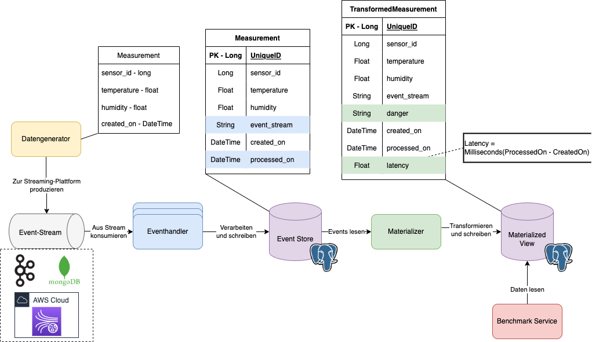

# ESC-Streaming-Architectures-Thesis-Materializer

The materializer part of the architecture from my thesis for Streaming Architectures developed in Go

You can run the Materializer with the following command at the project directory (ESC-Streaming-Architectures-Thesis-Materializer):
```shell script
go run materializer/materializer.go
```

## The architecture

